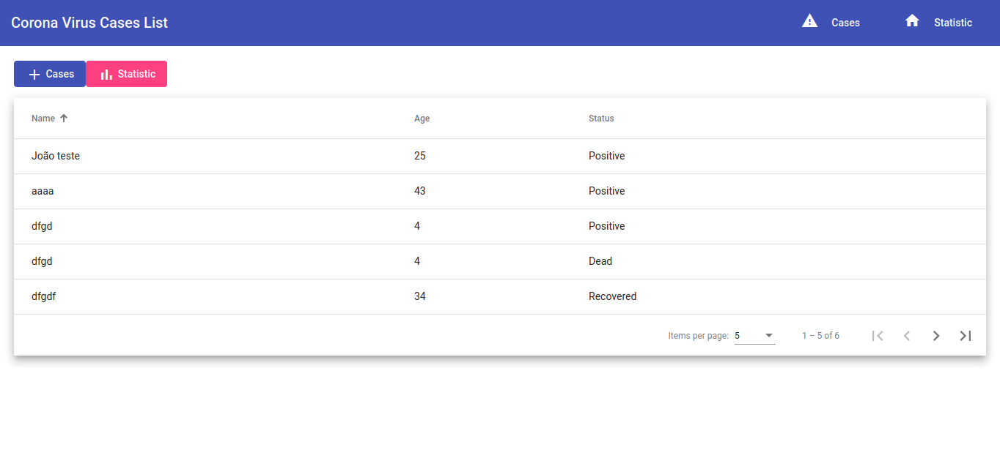

# How To Create Application In Angular 11

- [Requirements](#requirements)
- [Step #1. Create a New Angular App](#step-1-create-a-new-angular-app)
- [Step #2. Add Routing and Navigation](#step-2-add-routing-and-navigation)
- [Step #3. Add Models](#step-3-add-models)
- [Step #4. Add Service HTTP](#step-4-add-service-http)
- [Step #5. Install Angular Material](#step-5-install-angular-material)
- [Step #6. Add Navbar](#step-6-add-navbar)
- [Step #7. Display List Using Angular Material](#step-7-display-list-using-angular-material)
- [Step #8. Add a Data using Angular Material Form](#step-8-add-a-data-using-angular-material-form)
- [Step #9. Edit a Data using Angular Material Form](#step-9-edit-a-data-using-angular-material-form)
- [Step 10. Show and Delete Data Details using Angular Material](#step-10-show-and-delete-data-details-using-angular-material)
- [Step 11. Show Statistic using Ng2Charts and Chart.js](#step-11-show-statistic-using-ng2charts-and-chartjs)
- [Step 12. Deploy Application With Docker](#step-12-deploy-application-with-docker)

### Demos

<table>
  <tr>
    <td><br><span style="text-align: center">Table List Data</span></td>
    <td><br><span style="text-align: center">Table List Data</span></td>
  </tr>
</table>

### Requirements

1. **Node.js**: Angular requires a current, active LTS, or maintenance LTS version of Node.js.
2. **npm package manager**: Angular, the Angular CLI, and Angular applications depend on npm packages for many features and functions.

## Step #1. Create a new angular app

```console
$ npm install -g @angular/cli 
```

Create a workspace and initial application

```console
$ ng new my-app
```

If you get the question like below, choose `Yes` and `CSS` (or whatever you like to choose).


> ? Would you like to add Angular routing? Yes`
> ? Which stylesheet format would you like to use? CSS


> The Angular CLI includes a server, so that you can build and serve your app locally.

Navigate to the workspace folder, such as my-app. Run the following command:

```console
$ cd my-app

$ ng serve --open
```

> The ng serve command launches the server, watches your files, and rebuilds the app as you make changes to those files.
The --open (or just -o) option automatically opens your browser to http://localhost:4200/.

If your installation and setup was successful, you should see a page similar to the following.


## Step #2. Add routing and navigation

Next, we just add the required Angular components for this Coronavirus cases app. Just type these commands to generate them.

```console
$ ng g component cases
$ ng g component cases-details
$ ng g component add-cases
$ ng g component edit-cases 
$ ng g component cases-stat
```

Those components will automatically be registered to the app.module.ts. Next, create and edit `src/app/app-routing.module.ts` then add these imports.

```JS
import { CasesComponent } from './cases/cases.component';
import { CasesDetailsComponent } from './cases-details/cases-details.component';
import { CasesStatComponent } from './cases-stat/cases-stat.component';
import { AddCasesComponent } from './add-cases/add-cases.component';
import { EditCasesComponent } from './edit-cases/edit-cases.component';
```

Add these arrays to the existing routes constant that contain route for above-added components.

```JS
const routes: Routes = [
  {
    path: 'cases',
    component: CasesComponent,
    data: { title: 'List of Cases' }
  },
  {
    path: 'cases-details/:id',
    component: CasesDetailsComponent,
    data: { title: 'Cases Details' }
  },
  {
    path: 'cases-stat',
    component: CasesStatComponent,
    data: { title: 'Cases Statistic' }
  },
  {
    path: 'add-cases',
    component: AddCasesComponent,
    data: { title: 'Add Cases' }
  },
  {
    path: 'edit-cases/:id',
    component: EditCasesComponent,
    data: { title: 'Edit Cases' }
  },
  { path: '',
    redirectTo: '/cases',
    pathMatch: 'full'
  }
];
```

Open and edit `src/app/app.component.html` and you will see the existing router outlet.

```HTML
<div class="container">
  <router-outlet></router-outlet>
</div>
```

## Step #3. Add models

For models, create dir `src/app/models` and add files `cases.ts` and `statistic.ts`.

Add in `cases.ts`:

```JS
export class Cases {
  _id: string;
  name: string;
  gender: string;
  age: number;
  address: string;
  city: string;
  country: string;
  status: string;
  updated: Date;
}
```

And add in `statistic.ts`:


```JS
export class Statistic {
  _id: any;
  count: number;
}
```


## Step #4. Add service HTTP

Before creating a service for REST API access, first, we have to install or register `HttpClientModule`. Open and edit `src/app/app.module.ts` then add these imports of FormsModule, ReactiveFormsModule (@angular/forms) and HttpClientModule (@angular/common/http).

```JS
import { FormsModule, ReactiveFormsModule } from '@angular/forms';
import { HttpClientModule } from '@angular/common/http';
```

Next, add it to `@NgModule` imports after `BrowserModule`.

```JS
imports: [
  BrowserModule,
  FormsModule,
  ReactiveFormsModule,
  HttpClientModule,
  AppRoutingModule
],
```

Next, generate an Angular service by typing this command:

```console
$ ng g service services/api
```

Next, open and edit `src/app/services/api.service.ts` then add these imports.

```JS
import { Observable, of, throwError } from 'rxjs';
import { HttpClient, HttpHeaders, HttpErrorResponse } from '@angular/common/http';
import { catchError, tap, map } from 'rxjs/operators';
import { Cases } from '../models/cases';
import { Statistic } from '../models/statistic';
```

Add these constants before the `@Injectable`.

```JS
const httpOptions = {
  headers: new HttpHeaders({'Content-Type': 'application/json'})
};
const apiUrl = 'http://localhost:25250/api/';
```


Inject the `HttpClient` module to the constructor.

```JS
constructor(private http: HttpClient) { }
```

Add the error handler function that returns as an Observable.

```JS
private handleError<T> (operation = 'operation', result?: T) {
  return (error: any): Observable<T> => {

    // TODO: send the error to remote logging infrastructure
    console.error(error); // log to console instead

    // Let the app keep running by returning an empty result.
    return of(result as T);
  };
}
```

Add the functions for all CRUD (create, read, update, delete) REST API call of cases and statistic data. 

```JS
  getCases(): Observable<Cases[]> {
    return this.http.get<Cases[]>(`${apiUrl}`)
      .pipe(
        tap(cases => console.log('fetched cases')),
        catchError(this.handleError('getCases', []))
      );
  }

  getCasesById(id: string): Observable<Cases> {
    const url = `${apiUrl}/${id}`;
    return this.http.get<Cases>(url).pipe(
      tap(_ => console.log(`fetched cases id=${id}`)),
      catchError(this.handleError<Cases>(`getCasesById id=${id}`))
    );
  }

  addCases(cases: Cases): Observable<Cases> {
    return this.http.post<Cases>(apiUrl, cases, httpOptions).pipe(
      tap((c: Cases) => console.log(`added cases w/ id=${c._id}`)),
      catchError(this.handleError<Cases>('addCases'))
    );
  }

  updateCases(id: string, cases: Cases): Observable<any> {
    const url = `${apiUrl}/${id}`;
    return this.http.put(url, cases, httpOptions).pipe(
      tap(_ => console.log(`updated cases id=${id}`)),
      catchError(this.handleError<any>('updateCases'))
    );
  }

  deleteCases(id: string): Observable<Cases> {
    const url = `${apiUrl}/${id}`;
    return this.http.delete<Cases>(url, httpOptions).pipe(
      tap(_ => console.log(`deleted cases id=${id}`)),
      catchError(this.handleError<Cases>('deleteCases'))
    );
  }

  getStatistic(status: string): Observable<Statistic> {
    const url = `${apiUrl}/daily/${status}`;
    return this.http.get<Statistic>(url).pipe(
      tap(_ => console.log(`fetched statistic status=${status}`)),
      catchError(this.handleError<Statistic>(`getStatistic status=${status}`))
    );
  }
```

## Step #5. Install Angular Material

Next, for the user interface (UI) we will use Angular Material and CDK. There's a CLI for generating a Material component like Table as a component. Type this command to install Angular Material (@angular/material).

```console
$ ng add @angular/material
```

If there are questions like below, just use the default and **Yes** answer.

```
? Choose a prebuilt theme name, or "custom" for a custom theme: Indigo/Pink        [ Preview: http
s://material.angular.io?theme=indigo-pink ]
? Set up global Angular Material typography styles? Yes
? Set up browser animations for Angular Material? Yes
```

Create file `src/app/material.module.ts`. Open and edit that file then add these imports of required Angular Material Components.:

```JS
import {NgModule} from '@angular/core';

// Material Design
import { MatInputModule } from '@angular/material/input';
import { MatPaginatorModule } from '@angular/material/paginator';
import { MatProgressSpinnerModule } from '@angular/material/progress-spinner';
import { MatSortModule } from '@angular/material/sort';
import { MatTableModule } from '@angular/material/table';
import { MatIconModule } from '@angular/material/icon';
import { MatButtonModule } from '@angular/material/button';
import { MatCardModule } from '@angular/material/card';
import { MatFormFieldModule } from '@angular/material/form-field';
import { MatSliderModule } from '@angular/material/slider';
import { MatSlideToggleModule } from '@angular/material/slide-toggle';
import { MatButtonToggleModule } from '@angular/material/button-toggle';
import { MatSelectModule } from '@angular/material/select';
import {MatSidenavModule} from '@angular/material/sidenav';
import {MatToolbarModule} from '@angular/material/toolbar';
import {MatListModule} from '@angular/material/list';
```

Register the above modules to `@NgModule` imports and export.

```JS
@NgModule({
  imports: [
    MatSidenavModule,
    MatToolbarModule,
    MatIconModule,
    MatListModule,
    MatInputModule,
    MatPaginatorModule,
    MatProgressSpinnerModule,
    MatSortModule,
    MatTableModule,
    MatIconModule,
    MatButtonModule,
    MatCardModule,
    MatFormFieldModule,
    MatSliderModule,
    MatSlideToggleModule,
    MatButtonToggleModule,
    MatSelectModule,
  ],
  exports: [
    MatSidenavModule,
    MatToolbarModule,
    MatIconModule,
    MatListModule,
    MatInputModule,
    MatPaginatorModule,
    MatProgressSpinnerModule,
    MatSortModule,
    MatTableModule,
    MatButtonModule,
    MatCardModule,
    MatFormFieldModule,
    MatSliderModule,
    MatSlideToggleModule,
    MatButtonToggleModule,
    MatSelectModule,
  ]
})
export class MaterialModule {}
```

Go in `src/app/app.modules.ts` and add import.

```JS
import {MaterialModule} from './material.module';
```

Register the above modules to `@NgModule` imports.

```JS
imports: [
  ...
  MaterialModule,
],
```

## Step #6. Add Navbar

Edit and add in file `src/app/app.component.html`:

```html
<ngx-loading-bar color="#ff4081" height="4px"></ngx-loading-bar>

<mat-sidenav-container>
  <mat-sidenav #sidenav role="navigation">
    <mat-nav-list>
      <a mat-list-item>
        <mat-icon class="icon">input</mat-icon>
        <span class="label">Login</span>
      </a>
      <a mat-list-item>
        <mat-icon class="icon">home</mat-icon>
        <span class="label">Home</span>
      </a>
      <a mat-list-item>
        <mat-icon class="icon">dashboard</mat-icon>
        <span class="label">Dashboard</span>
      </a>
      <a mat-list-item type="button">
        <mat-icon class="icon">input</mat-icon>
        <span class="label">LogOut</span>
      </a>
    </mat-nav-list>
  </mat-sidenav>
  <mat-sidenav-content>
    <mat-toolbar color="primary">
      <div fxHide.gt-xs>
        <button mat-icon-button>
          <mat-icon>menu</mat-icon>
        </button>
      </div>
      <div>
        <a>
          Corona Virus Cases List
        </a>
      </div>
      <div fxFlex fxLayout fxLayoutAlign="flex-end" fxHide.xs>
        <ul fxLayout fxLayoutGap="20px" class="navigation-items">
          <li>
            <a mat-flat-button color="primary" [routerLink]="['/cases']">
              <mat-icon class="icon">warning</mat-icon>
              <span class="label">Cases</span>
            </a>
          </li>
          <li>
            <a mat-flat-button color="primary" [routerLink]="['/cases-stat']">
              <mat-icon class="icon">home</mat-icon>
              <span class="label">Statistic</span>
            </a>
          </li>
        </ul>
      </div>
    </mat-toolbar>
    <main>
    </main>
  </mat-sidenav-content>
</mat-sidenav-container>
...
<div class="container">
  <router-outlet></router-outlet>
</div>
```

Open and edit `src/app/app.component.css` then replace all css codes with this:

```css
  a {
    text-decoration: none;
    color: white;
  }
  
  a:hover,
  a:active {
    color: lightgray;
  }
  
  .navigation-items {
    list-style: none;
    padding: 0;
    margin: 0;
    cursor: pointer;
  }
  
  .icon {
    display: inline-block;
    height: 30px;
    margin: 0 auto;
    padding-right: 5px;
    text-align: center;
    vertical-align: middle;
    width: 15%;
  }
  
  .label {
    display: inline-block;
    line-height: 30px;
    margin: 10px;
    width: 75%;
  }

  .container {
    padding: 20px;
  }
```

## Step #7. Display List using Angular Material

For that, open and edit `src/app/cases/cases.component.ts` then replace to this import.

```js
import { Component, OnInit, ViewChild } from '@angular/core';
import { ApiService } from '../services/api.service';
import { Cases } from '../models/cases';
import {MatSort} from '@angular/material/sort';
import {MatPaginator} from '@angular/material/paginator';
import {MatTableDataSource} from '@angular/material/table';
```

Next, inject the API Service to the constructor.

```js
constructor(private api: ApiService) { }
```

Declare the variables of Angular Material Table Data Source before the constructor.

```js
displayedColumns: string[] = ['name', 'age', 'status'];
data: Cases[] = [];
isLoadingResults = true;
```

Add variables to support paginator and sortable:

```js
@ViewChild(MatSort) sort: MatSort;
@ViewChild(MatPaginator) paginator: MatPaginator;
```

Modify the `ngOnInit` function to get a list of cases immediately.

```js
ngOnInit(): void {
  this.api.getCases()
  .subscribe((res: any) => {
    this.data = new MatTableDataSource(res);
    this.data.sort = this.sort;
    this.data.paginator = this.paginator;
    
    this.isLoadingResults = false;
  }, err => {
    console.log(err);
    this.isLoadingResults = false;
  });
}
```

Next, open and edit `src/app/cases/cases.component.html` then replace all HTML tags with this Angular Material tags.

```html
<div class="example-container ">
    <div class="example-loading-shade" *ngIf="isLoadingResults">
        <mat-spinner *ngIf="isLoadingResults"></mat-spinner>
    </div>
    <div class="button-row">
        <a mat-flat-button color="primary" [routerLink]="['/add-cases']">
            <mat-icon>add</mat-icon> Cases
        </a>
        <a mat-flat-button color="accent" [routerLink]="['/cases-stat']">
            <mat-icon>bar_chart</mat-icon> Statistic
        </a>
    </div>
    <div class="mat-elevation-z8" style="margin-top: 15px">
        <table mat-table [dataSource]="data" class="example-table" matSort matSortActive='name' matSortDirection="asc">

            <!-- Position Column -->
            <ng-container matColumnDef="position">
                <th mat-header-cell *matHeaderCellDef> No. </th>
                <td mat-cell *matCellDef="let row"> 1 </td>
            </ng-container>

            <!-- Cases Name Column -->
            <ng-container matColumnDef="name">
                <th mat-header-cell *matHeaderCellDef mat-sort-header>Name</th>
                <td mat-cell *matCellDef="let row">{{row.name}}</td>
            </ng-container>

            <!-- Cases Age Column -->
            <ng-container matColumnDef="age">
                <th mat-header-cell *matHeaderCellDef mat-sort-header>Age</th>
                <td mat-cell *matCellDef="let row">{{row.age}}</td>
            </ng-container>

            <!-- Cases Status Column -->
            <ng-container matColumnDef="status">
                <th mat-header-cell *matHeaderCellDef mat-sort-header>Status</th>
                <td mat-cell *matCellDef="let row">{{row.status}}</td>
            </ng-container>

            <tr mat-header-row *matHeaderRowDef="displayedColumns"></tr>
            <tr mat-row *matRowDef="let row; columns: displayedColumns;" [routerLink]="['/cases-details/', row._id]">
            </tr>
        </table>
        <mat-paginator [pageSizeOptions]="[5, 10, 20]" showFirstLastButtons></mat-paginator>
    </div>
</div>
```

Next, open and edit `src/app/cases/cases.component.css` then replace all CSS.

```css
/* Structure */
table {
  width: 100%;
}

th.mat-sort-header-sorted {
  color: black;
}
```

## Step #8. Add a Data using Angular Material Form

To create a form for adding a Coronavirus case, open and edit `src/app/add-cases/add-cases.component.ts` then add these imports.

```js
import { Component, OnInit } from '@angular/core';
import { Router } from '@angular/router';
import { ApiService } from '../api.service';
import { FormControl, FormGroupDirective, FormBuilder, FormGroup, NgForm, Validators, ReactiveFormsModule } from '@angular/forms';
import { ErrorStateMatcher } from '@angular/material/core';
```

Inject the above modules to the constructor.

```js
constructor(private router: Router, private api: ApiService, private formBuilder: FormBuilder) { }
```

Declare variables for the Form Group and all of the required fields inside the form before the constructor

```js
  casesForm: FormGroup;
  name = '';
  gender = '';
  age: number = null;
  address = '';
  city = '';
  country = '';
  status = '';
  statusList = ['Positive', 'Dead', 'Recovered'];
  genderList = ['Male', 'Female'];
  isLoadingResults = false;
  matcher = new MyErrorStateMatcher();
```

Add initial validation for each field.

```js
  ngOnInit(): void {
    this.casesForm = this.formBuilder.group({
      name: new FormControl('', [Validators.required]),
      gender: new FormControl('', [Validators.required]),
      age: new FormControl('', [Validators.required]),
      address: new FormControl('', [Validators.required]),
      city: new FormControl('', [Validators.required]),
      country: new FormControl('', [Validators.required]),
      status: new FormControl('', [Validators.required]),
    });
  }
```

Create a function for submitting or POST cases form.

```js
  onFormSubmit() {
    this.isLoadingResults = true;
    this.api.addCases(this.casesForm.value)
      .subscribe((res: any) => {
          const id = res._id;
          this.isLoadingResults = false;
          this.router.navigate(['/cases-details', id]);
        }, (err: any) => {
          console.log(err);
          this.isLoadingResults = false;
        });
  }
```

Create a new class before the main class `@Components`.

```js
/** Error when invalid control is dirty, touched, or submitted. */
export class MyErrorStateMatcher implements ErrorStateMatcher {
  isErrorState(control: FormControl | null, form: FormGroupDirective | NgForm | null): boolean {
    const isSubmitted = form && form.submitted;
    return !!(control && control.invalid && (control.dirty || control.touched || isSubmitted));
  }
}
```

Next, open and edit `src/app/add-cases/add-cases.component.html` then replace all HTML tags with this.

```html
<div class="example-container mat-elevation-z8">
  <div class="example-loading-shade"
        *ngIf="isLoadingResults">
    <mat-spinner *ngIf="isLoadingResults"></mat-spinner>
  </div>
  <div class="button-row">
    <a mat-flat-button color="primary" [routerLink]="['/cases']"><mat-icon>list</mat-icon></a>
  </div>
  <mat-card class="example-card">
    <form [formGroup]="casesForm" (ngSubmit)="onFormSubmit()">
      <mat-form-field class="example-full-width">
        <mat-label>Name</mat-label>
        <input matInput placeholder="Name" formControlName="name"
                [errorStateMatcher]="matcher">
        <mat-error>
          <span *ngIf="!casesForm.get('name').valid && casesForm.get('name').touched">Please enter Name</span>
        </mat-error>
      </mat-form-field>
      <mat-form-field class="example-full-width">
        <mat-label>Gender</mat-label>
        <mat-select formControlName="gender">
          <mat-option *ngFor="let gl of genderList" [value]="gl">
            {{gl}}
          </mat-option>
        </mat-select>
        <mat-error>
          <span *ngIf="!casesForm.get('gender').valid && casesForm.get('gender').touched">Please choose Gender</span>
        </mat-error>
      </mat-form-field>
      <mat-form-field class="example-full-width">
        <mat-label>Age</mat-label>
        <input matInput type="number" placeholder="Age" formControlName="age"
                [errorStateMatcher]="matcher">
        <mat-error>
          <span *ngIf="!casesForm.get('age').valid && casesForm.get('age').touched">Please enter Age</span>
        </mat-error>
      </mat-form-field>
      <mat-form-field class="example-full-width">
        <mat-label>Address</mat-label>
        <input matInput placeholder="Address" formControlName="address"
                [errorStateMatcher]="matcher">
        <mat-error>
          <span *ngIf="!casesForm.get('address').valid && casesForm.get('address').touched">Please enter Address</span>
        </mat-error>
      </mat-form-field>
      <mat-form-field class="example-full-width">
        <mat-label>City</mat-label>
        <input matInput placeholder="City" formControlName="city"
                [errorStateMatcher]="matcher">
        <mat-error>
          <span *ngIf="!casesForm.get('city').valid && casesForm.get('city').touched">Please enter City</span>
        </mat-error>
      </mat-form-field>
      <mat-form-field class="example-full-width">
        <mat-label>Country</mat-label>
        <input matInput placeholder="Country" formControlName="country"
                [errorStateMatcher]="matcher">
        <mat-error>
          <span *ngIf="!casesForm.get('country').valid && casesForm.get('country').touched">Please enter Country</span>
        </mat-error>
      </mat-form-field>
      <mat-form-field class="example-full-width">
        <mat-label>Status</mat-label>
        <mat-select formControlName="status">
          <mat-option *ngFor="let sl of statusList" [value]="sl">
            {{sl}}
          </mat-option>
        </mat-select>
        <mat-error>
          <span *ngIf="!casesForm.get('status').valid && casesForm.get('status').touched">Please select Status</span>
        </mat-error>
      </mat-form-field>
      <div class="button-row">
        <button type="submit" [disabled]="!casesForm.valid" mat-flat-button color="primary"><mat-icon>save</mat-icon></button>
      </div>
    </form>
  </mat-card>
</div>
```

Finally, open and edit `src/app/add-cases/add-cases.component.css` then add this CSS codes.

```css
/* Structure */
.example-container {
  position: relative;
  padding: 5px;
}

.example-form {
  min-width: 150px;
  max-width: 500px;
  width: 100%;
}

.example-full-width {
  width: 100%;
}

.example-full-width:nth-last-child(0) {
  margin-bottom: 10px;
}

.button-row {
  margin: 10px 0;
}

.mat-flat-button {
  margin: 5px;
}
```

## Step #9. Edit a Data using Angular Material Form

We already put an edit button inside the Cases Details component for the call Edit page. Now, open and edit `src/app/edit-cases/edit-cases.component.ts` then add these imports.

```js
import { Component, OnInit } from '@angular/core';
import { Router, ActivatedRoute } from '@angular/router';
import { ApiService } from '../services/api.service';
import { FormControl, FormGroupDirective, FormBuilder, FormGroup, NgForm, Validators } from '@angular/forms';
import { ErrorStateMatcher } from '@angular/material/core';
```

Inject the above modules to the constructor.

```js
constructor(private router: Router, private route: ActivatedRoute, private api: ApiService, private formBuilder: FormBuilder) { }
```

Declare the Form Group variable and all of the required variables for the cases-form before the constructor.

```js
  casesForm: FormGroup;
  _id = '';
  name = '';
  gender = '';
  age: number = null;
  address = '';
  city = '';
  country = '';
  status = '';
  statusList = ['Positive', 'Dead', 'Recovered'];
  genderList = ['Male', 'Female'];
  isLoadingResults = false;
  matcher = new MyErrorStateMatcher();
```

Next, add validation for all fields when the component is initiated.

```js
ngOnInit(): void {
  this.getCasesById(this.route.snapshot.params.id);
  this.casesForm = this.formBuilder.group({
    name: new FormControl('', [Validators.required]),
    gender: new FormControl('', [Validators.required]),
    age: new FormControl('', [Validators.required]),
    address: new FormControl('', [Validators.required]),
    city: new FormControl('', [Validators.required]),
    country: new FormControl('', [Validators.required]),
    status: new FormControl('', [Validators.required]),
  });
}
```

Create a function for getting cases data that filled to each form field.

```js
  getCasesById(id: any) {
    this.api.getCasesById(id).subscribe((data: any) => {
      this._id = data._id;
      this.casesForm.setValue({
        name: data.name,
        gender: data.gender,
        age: data.age,
        address: data.address,
        city: data.city,
        country: data.country,
        status: data.status
      });
    });
  }
```

Create a function to update the case changes.

```js
  onFormSubmit() {
    this.isLoadingResults = true;
    this.api.updateCases(this._id, this.casesForm.value)
      .subscribe((res: any) => {
          const id = res._id;
          this.isLoadingResults = false;
          this.router.navigate(['/cases-details', id]);
        }, (err: any) => {
          console.log(err);
          this.isLoadingResults = false;
        }
      );
  }
```

Add a function for handling the show cases details button.

```js
  casesDetails() {
    this.router.navigate(['/cases-details', this._id]);
  }
```

Create a new class before the main class `@Components`.

```js
/** Error when invalid control is dirty, touched, or submitted. */
export class MyErrorStateMatcher implements ErrorStateMatcher {
  isErrorState(control: FormControl | null, form: FormGroupDirective | NgForm | null): boolean {
    const isSubmitted = form && form.submitted;
    return !!(control && control.invalid && (control.dirty || control.touched || isSubmitted));
  }
}
```

Next, open and edit `src/app/edit-cases/edit-cases.component.html` then replace all HTML tags with this.

```html
  <div class="example-container mat-elevation-z8">
    <div class="example-loading-shade"
          *ngIf="isLoadingResults">
      <mat-spinner *ngIf="isLoadingResults"></mat-spinner>
    </div>
    <div class="button-row">
        <a mat-flat-button color="primary" (click)="casesDetails()"><mat-icon>info</mat-icon></a>
    </div>
    <mat-card class="example-card">
      <form [formGroup]="casesForm" (ngSubmit)="onFormSubmit()">
        <mat-form-field class="example-full-width">
          <mat-label>Name</mat-label>
          <input matInput placeholder="Name" formControlName="name"
                  [errorStateMatcher]="matcher">
          <mat-error>
            <span *ngIf="!casesForm.get('name').valid && casesForm.get('name').touched">Please enter Name</span>
          </mat-error>
        </mat-form-field>
        <mat-form-field class="example-full-width">
          <mat-label>Gender</mat-label>
          <mat-select formControlName="gender">
            <mat-option *ngFor="let gl of genderList" [value]="gl">
              {{gl}}
            </mat-option>
          </mat-select>
          <mat-error>
            <span *ngIf="!casesForm.get('gender').valid && casesForm.get('gender').touched">Please choose Gender</span>
          </mat-error>
        </mat-form-field>
        <mat-form-field class="example-full-width">
          <mat-label>Age</mat-label>
          <input matInput type="number" placeholder="Age" formControlName="age"
                  [errorStateMatcher]="matcher">
          <mat-error>
            <span *ngIf="!casesForm.get('age').valid && casesForm.get('age').touched">Please enter Age</span>
          </mat-error>
        </mat-form-field>
        <mat-form-field class="example-full-width">
          <mat-label>Address</mat-label>
          <input matInput placeholder="Address" formControlName="address"
                  [errorStateMatcher]="matcher">
          <mat-error>
            <span *ngIf="!casesForm.get('address').valid && casesForm.get('address').touched">Please enter Address</span>
          </mat-error>
        </mat-form-field>
        <mat-form-field class="example-full-width">
          <mat-label>City</mat-label>
          <input matInput placeholder="City" formControlName="city"
                  [errorStateMatcher]="matcher">
          <mat-error>
            <span *ngIf="!casesForm.get('city').valid && casesForm.get('city').touched">Please enter City</span>
          </mat-error>
        </mat-form-field>
        <mat-form-field class="example-full-width">
          <mat-label>Country</mat-label>
          <input matInput placeholder="Country" formControlName="country"
                  [errorStateMatcher]="matcher">
          <mat-error>
            <span *ngIf="!casesForm.get('country').valid && casesForm.get('country').touched">Please enter Country</span>
          </mat-error>
        </mat-form-field>
        <mat-form-field class="example-full-width">
          <mat-label>Status</mat-label>
          <mat-select formControlName="status">
            <mat-option *ngFor="let sl of statusList" [value]="sl">
              {{sl}}
            </mat-option>
          </mat-select>
          <mat-error>
            <span *ngIf="!casesForm.get('status').valid && casesForm.get('status').touched">Please select Status</span>
          </mat-error>
        </mat-form-field>
        <div class="button-row">
          <button type="submit" [disabled]="!casesForm.valid" mat-flat-button color="primary"><mat-icon>save</mat-icon></button>
        </div>
      </form>
    </mat-card>
  </div>
```

Finally, open and edit `src/app/edit-cases/edit-cases.component.css` then add these lines of CSS codes.

```css
/* Structure */
  .example-container {
    position: relative;
    padding: 5px;
  }
  
  .example-form {
    min-width: 150px;
    max-width: 500px;
    width: 100%;
  }
  
  .example-full-width {
    width: 100%;
  }
  
  .example-full-width:nth-last-child(0) {
    margin-bottom: 10px;
  }
  
  .button-row {
    margin: 10px 0;
  }
  
  .mat-flat-button {
    margin: 5px;
  }
```

## Step #10. Show and Delete Data Details using Angular Material

On the list page, there are 2 buttons to navigate to the Details and Statistic page. For, Details page the button action also sends an ID parameter. Next, open and edit `src/app/cases-details/cases-details.component.ts` then add these lines of imports.

```js
import { Component, OnInit } from '@angular/core';
import { ActivatedRoute, Router } from '@angular/router';
import { ApiService } from '../services/api.service';
import { Cases } from '../models/cases';
```

Inject the above modules to the constructor.

```js
constructor(private route: ActivatedRoute, private api: ApiService, private router: Router) { }
```

Declare the variables before the constructor for hold cases data that get from the API.

```js
cases: Cases = { _id: '', name: '', gender: '', age: null, address: '', city: '', country: '', status: '', updated: null };
isLoadingResults = true;
```

Add a function for getting Cases data from the API.

```js
getCasesDetails(id: string) {
  this.api.getCasesById(id)
    .subscribe((data: any) => {
      this.cases = data;
      console.log(this.cases);
      this.isLoadingResults = false;
    });
}
```

Call that function when the component is initiated.

```js
ngOnInit(): void {
  this.getCasesDetails(this.route.snapshot.params.id);
}
```

Add this function to delete a case.

```js
deleteCases(id: any) {
  this.isLoadingResults = true;
  this.api.deleteCases(id)
    .subscribe(res => {
        this.isLoadingResults = false;
        this.router.navigate(['/cases']);
      }, (err) => {
        console.log(err);
        this.isLoadingResults = false;
      }
    );
}
```

For the view, open and edit `src/app/cases-details/cases-details.component.html` then replace all HTML tags with this.

```html
<div class="example-container mat-elevation-z8">
  <div class="example-loading-shade"
        *ngIf="isLoadingResults">
    <mat-spinner *ngIf="isLoadingResults"></mat-spinner>
  </div>
  <div class="button-row">
    <a mat-flat-button color="primary" [routerLink]="['/cases']"><mat-icon>list</mat-icon></a>
  </div>
  <mat-card class="example-card">
    <mat-card-header>
      <mat-card-title><h2>{{cases.name}}</h2></mat-card-title>
      <mat-card-subtitle>{{cases.age}} year old</mat-card-subtitle>
    </mat-card-header>
    <mat-card-content>
      <dl>
        <dt>Gender:</dt>
        <dd>{{cases.gender}}</dd>
        <dt>Address:</dt>
        <dd>{{cases.address}}</dd>
        <dt>City:</dt>
        <dd>{{cases.city}}</dd>
        <dt>Country:</dt>
        <dd>{{cases.country}}</dd>
        <dt>Status:</dt>
        <dd><h2>{{cases.status}}</h2></dd>
      </dl>
    </mat-card-content>
    <mat-card-actions>
      <a mat-flat-button color="primary" [routerLink]="['/edit-cases', cases._id]"><mat-icon>edit</mat-icon> Cases</a>
      <a mat-flat-button color="warn" (click)="deleteCases(cases._id)"><mat-icon>delete</mat-icon> Cases</a>
    </mat-card-actions>
  </mat-card>
</div>
```

Finally, open and edit `src/app/cases-details/cases-details.component.css` then add this lines of CSS codes.

```css
/* Structure */
.example-container {
  position: relative;
  padding: 5px;
}

.example-loading-shade {
  position: absolute;
  top: 0;
  left: 0;
  bottom: 56px;
  right: 0;
  background: rgba(0, 0, 0, 0.15);
  z-index: 1;
  display: flex;
  align-items: center;
  justify-content: center;
}

.mat-flat-button {
  margin: 5px;
}
```

## Step #11. Show Statistic using Ng2Charts and Chart.js

We will use a bar chart to display the statistic of Coronavirus cases. So, we need to install Ng2Charts and Chart.js modules by type this command.

```console
$ npm i --save ng2-charts chart.js
```

Or via Yarn

```console
$ yarn add ng2-charts chart.js
```

Next, open and edit `src/app/app.module.ts` then add this import of ng2-charts.

```js
import { ChartsModule } from 'ng2-charts';
```

Add this module to the @NgModule imports.

```js
imports: [
  ...
  ChartsModule
],
```

Next, open and edit `src/app/cases-stat/cases-stat.component.ts` then add these imports of chart.js ChartOptions, ChartType, ChartDataSets, ng2-charts Label, ApiService, and Statistic data type. 

```js
import { Component, OnInit } from '@angular/core';
import { ChartOptions, ChartType, ChartDataSets } from 'chart.js';
import { Label } from 'ng2-charts';
import { ApiService } from '../services/api.service';
import { Statistic } from '../models/statistic';
```

Declare these required variables before the constructor for building a bar chart.

```js
stats: Statistic[] = [];
label = 'Positive';
isLoadingResults = true;
barChartOptions: ChartOptions = {
  responsive: true,
};
barChartLabels: Label[] = [];
barChartType: ChartType = 'bar';
barChartLegend = true;
barChartPlugins = [];
barChartData: ChartDataSets[] = [{ data: [], backgroundColor: [], label: this.label }];
```

Inject ApiService to the constructor.

```js
constructor(private api: ApiService) { }
```

Add a function to load statistic data from REST API then implement it as a bar chart.

```js
getStatistic(status: string) {
  this.barChartData = [{ data: [], backgroundColor: [], label: this.label }];
  this.barChartLabels = [];
  this.api.getStatistic(status)
  .subscribe((res: any) => {
    this.stats = res;
    const chartdata: number[] = [];
    const chartcolor: string[] = [];
    this.stats.forEach((stat) => {
      this.barChartLabels.push(stat._id.date);
      chartdata.push(stat.count);
      if (this.label === 'Positive') {
        chartcolor.push('rgba(255, 165, 0, 0.5)');
      } else if (this.label === 'Dead') {
        chartcolor.push('rgba(255, 0, 0, 0.5)');
      } else {
        chartcolor.push('rgba(0, 255, 0, 0.5)');
      }
    });
    this.barChartData = [{ data: chartdata, backgroundColor: chartcolor, label: this.label }];
    this.isLoadingResults = false;
  }, err => {
    console.log(err);
    this.isLoadingResults = false;
  });
}
```

Call that function to the NgOnInit function.

```js
ngOnInit(): void {
  this.getStatistic(this.label);
}
```

Add a function to switch or reload statistic data by status value.

```js
changeStatus() {
  this.isLoadingResults = true;
  this.getStatistic(this.label);
}
```

Next, open and edit `src/app/cases-stat/cases-stat.component.html` then replace all HTML tags with this implementation of an ng2-charts/Chart.js bar chart with statistic data.

```html
<div class="example-container mat-elevation-z8">
  <div class="example-loading-shade"
        *ngIf="isLoadingResults">
    <mat-spinner *ngIf="isLoadingResults"></mat-spinner>
  </div>
  <div class="button-row">
    <a mat-flat-button color="primary" [routerLink]="['/cases']"><mat-icon>list</mat-icon></a>
  </div>
  <div class="button-row">
    <mat-button-toggle-group name="status" aria-label="Status" [(ngModel)]="label" (ngModelChange)="changeStatus()">
      <mat-button-toggle value="Positive">Positive</mat-button-toggle>
      <mat-button-toggle value="Dead">Dead</mat-button-toggle>
      <mat-button-toggle value="Recovered">Recovered</mat-button-toggle>
    </mat-button-toggle-group>
  </div>
  <div style="display: block;">
    <canvas baseChart
      [datasets]="barChartData"
      [labels]="barChartLabels"
      [options]="barChartOptions"
      [plugins]="barChartPlugins"
      [legend]="barChartLegend"
      [chartType]="barChartType">
    </canvas>
  </div>
</div>
```

Finally, give it a little style by modify `src/app/cases-stat/cases-stat.component.scss` with these.

```css
/* Structure */
.example-container {
  position: relative;
  padding: 5px;
}

.example-loading-shade {
  position: absolute;
  top: 0;
  left: 0;
  bottom: 56px;
  right: 0;
  background: rgba(0, 0, 0, 0.15);
  z-index: 1;
  display: flex;
  align-items: center;
  justify-content: center;
}

.mat-flat-button {
  margin: 5px;
}
```

## Step #12. Deploy Application With Docker

Let's create a `Dockerfile` at the root of the project, open and edit it with the following code.

```Dockerfile
# Image
FROM node:alpine

# set working directory
WORKDIR /app

# add `/app/node_modules/.bin` to $PATH
ENV PATH /app/node_modules/.bin:$PATH

# install and cache app dependencies
COPY package.json /app/package.json
RUN yarn install
# install angular in path
RUN npm install -g @angular/cli

# add app
COPY . /app

# start app in the docker container
CMD ng serve --host 0.0.0.0
```

We will pull the NodeJS image as the base of our angular application `FROM node:alpine`, then we set the `app` folder as the application's working folder `WORKDIR /app`, we add the NodeJS to the container path `ENV PATH /app/node_modules/.bin:$PATH`, we copy the package.json file to the app folder `COPY package.json /app/package.json`, we install the project dependencies using Yarn `RUN yarn install`, we install the angular globally in the container `RUN npm install -g @angular/cli`, we copy all the other project files to the app workbook `COPY . /app` and then we start the angular server on port 80 with the command `CMD ng serve --host 0.0.0.0`.

After that, our customized image is created.

Next, create `docker-compose.yml` at the root of the project, open and edit with the following code.

```YAML
version: "3.5"

services:
  app:
    build: .
    restart: always
    ports:
      - "4200:4200"
    volumes:
      - "/app/node_modules"
      - "./:/app"
```

Now, we have to build the container using this command.

```console
$ docker-compose up -d
```

If you want to rebuild the image, add the `--build` option by running the following command

```console
$ docker-compose up -d --build
```

This will create a container running our image on port 4200.

# Voialá!!!!!  :stuck_out_tongue_closed_eyes: :heart: :metal:
### Open http://0.0.0.0:4200 and the application will be beautiful!!! :hamster: